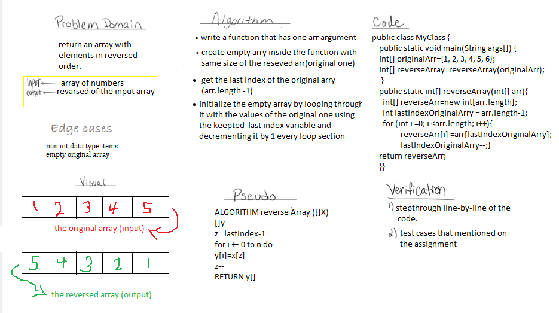

# Reverse an Array
Write a function called reverseArray which takes an array as an argument. Without utilizing any of the built-in methods available to your language, return an array with elements in reversed order.

## Whiteboard Process

## Approach & Efficiency
get more knowledge to deal with arrays
and improve the way of thinking by breaking down the problem into small pieces