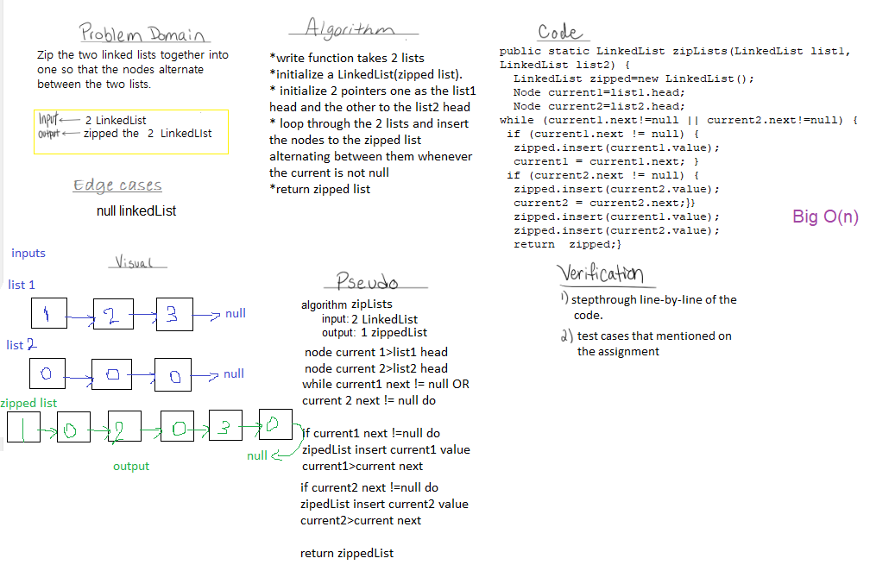
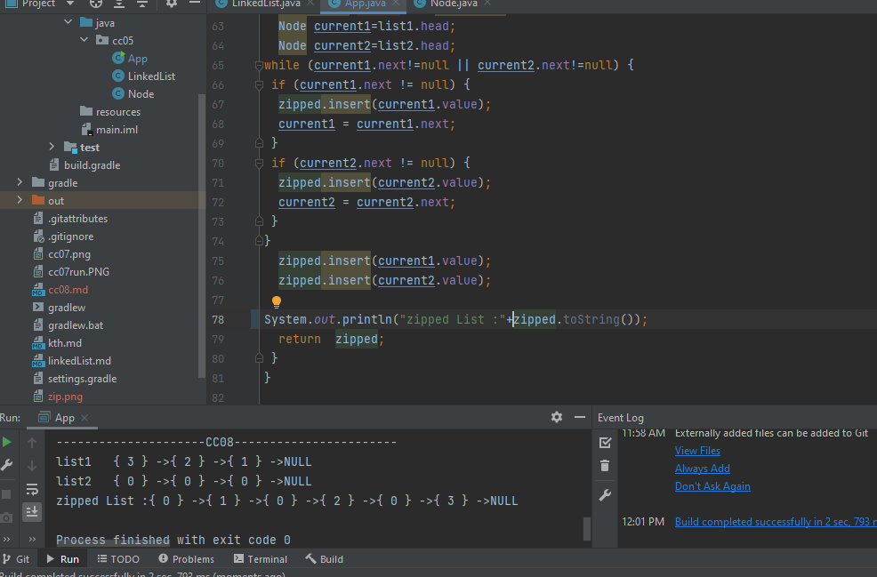

# Challenge Summary
Write a function called zip lists
Arguments: 2 linked lists
Return: zipped Linked List
Zip the two linked lists together into one so that the nodes alternate between the two lists and return a reference to the head of the zipped list.

## Whiteboard Process

## Approach & Efficiency
get more knowledge to deal with arrays and improve the way of thinking by breaking down the problem into small pieces

## Solution
